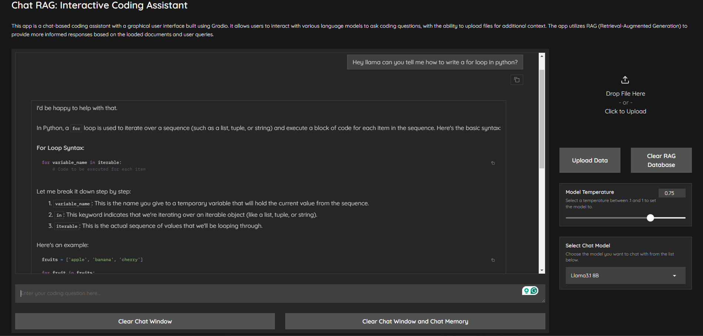

# Chat RAG: Interactive Coding Assistant

## Overview

CodeChat RAG is an interactive coding assistant that leverages Retrieval-Augmented Generation (RAG) to provide 
informed responses to coding queries. Built with a user-friendly Gradio interface, it allows users to interact with 
various language models, change model temperature, the models prompt, and upload context files for more accurate assistance.

## Features

- **Multiple Language Models**: Choose from models like Codestral, Mistral-Nemo, LLaMA3.1, DeepSeek Coder v2, Gemma2, and CodeGemma.
- **RAG-powered Responses**: Utilizes uploaded documents to provide context-aware answers.
- **Interactive Chat Interface**: Easy-to-use chat interface for asking coding questions.
- **File Upload**: Support for uploading additional context files.
- **Model Switching**: Seamlessly switch between different language models.
- **Reset Chat Engine**: Clear chat history and memory to start fresh.
- **Delete Database**: Easily delete all stored data for privacy and reset purposes.
- **Enhanced Memory Management**: Dynamically manage chat memory for different models.
- **Refined Chat Prompts**: Contextual prompts guide the AI for more accurate and useful responses.


## Usage

1. Run the application:
    ```bash
    gradio chatrag.py
   ```
2. The app will automatically open a new tab and launch in your browser.
3. (Optional) Upload relevant files for additional context.
4. Select a language model from the dropdown menu.
5. Type your coding question in the text box and press enter.
6. The model will stream the response to your query back to you in the chat window.


## Project Structure

- `chatrag.py`: Main application entry point and Gradio setup
- `chat.py`: Core chat functionality, including document loading and chat engine setup
- `gr_utils.py`: Gradio utils
- `model_utils.py`: Manages model selection, memory, and user input processing
- `utils.py`: Utility functions for embedding, LLM setup, and chat engine configuration

## Pictures
### Start State of the App

### Dropdown Menu in Action

### Llama 3.1 Query Example

### RAG Query Example


### Need Help or Have Feature Suggestions
Feel free to reach out to me through GitHub, LinkedIn, or through email. All of those are available on my website [JFCoded](https://www.jfcoded.com/contact).