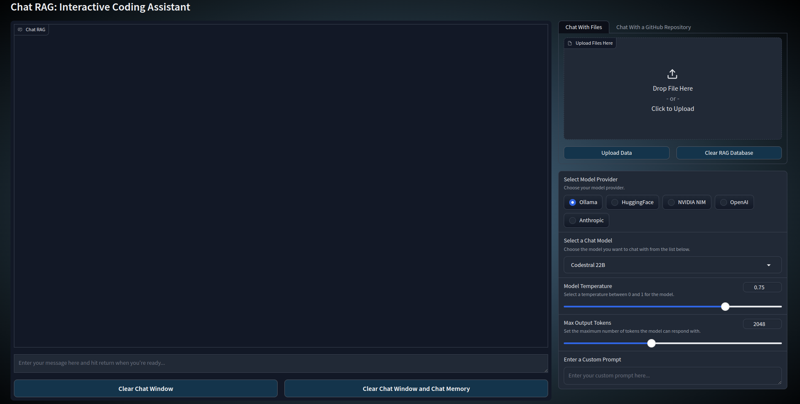
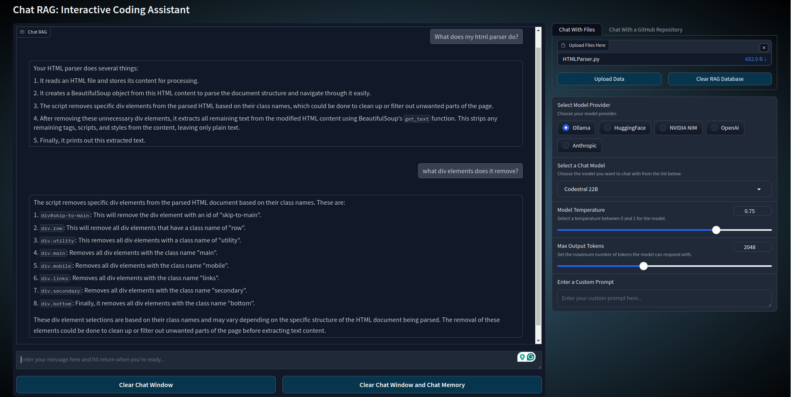

# Chat RAG: Interactive Coding Assistant

## Overview

CodeChat RAG is an interactive coding assistant that leverages Retrieval-Augmented Generation (RAG) to provide informed 
responses to coding queries. Built with a user-friendly Gradio interface, it allows users to interact with various 
language models and upload context files for more accurate assistance.

## Features

- **Multiple Language Models**: Choose from models like Codestral, Mistral-Nemo, LLaMA3.1, DeepSeek Coder, Gemma2, and CodeGemma.
- **RAG-powered Responses**: Utilizes uploaded documents to provide context-aware answers.
- **Interactive Chat Interface**: Easy-to-use chat interface for asking coding questions.
- **File Upload**: Support for uploading additional context files.
- **Model Switching**: Seamlessly switch between different language models.

## Usage

1. Run the application:
2. Open the provided URL in your web browser.
3. (Optional) Upload relevant files for additional context.
4. Select a language model from the dropdown menu.
5. Type your coding question in the text box and press enter.

## Project Structure

- `app.py`: Main application entry point
- `chat.py`: Core chat functionality and document loading
- `cwc_gradio.py`: Gradio interface setup
- `model_manager.py`: Manages model selection and threading
- `utils.py`: Utility functions for embedding, LLM setup, and chat engine configuration

## Pictures
### Start State of the App

### Dropdown Menu in Action

### RAG Query Example

