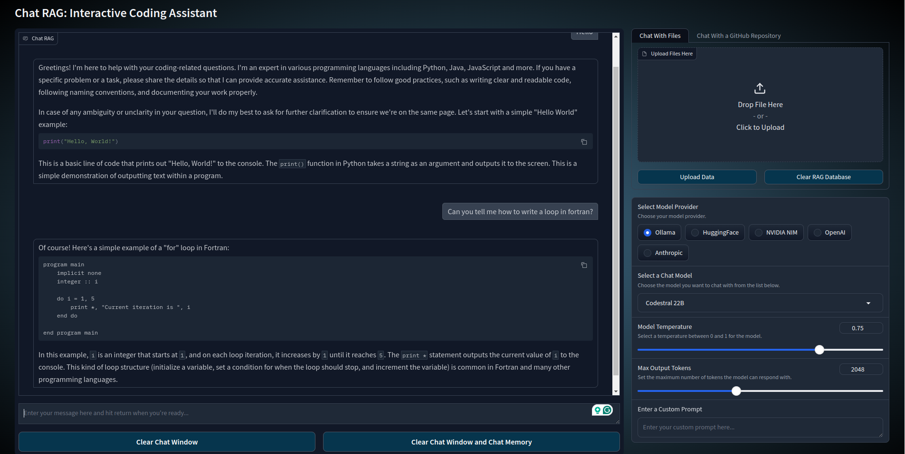

# Chat RAG: Interactive Coding Assistant

## Overview
Chat RAG is an advanced interactive coding assistant that leverages Retrieval-Augmented Generation (RAG) to provide 
informed responses to coding queries. Built with a user-friendly Gradio interface, it allows users to interact 
with various language models, customize model parameters, and upload context files for more accurate assistance.


## Features
- **Multiple Model Providers**: Support for Ollama, HuggingFace, NVIDIA NIM, OpenAI, and Anthropic models. 
(**If you don't see all of these providers make sure you have all the environment variables set in the .env file!**)
- **Wide Range of Language Models**: Choose from models like Codestral, Mistral-Nemo, LLaMA3.1, DeepSeek Coder v2, Gemma2, and CodeGemma.
- **Dynamic Model Switching**: Seamlessly switch between different language models.
- **Customizable Model Parameters**: Adjust temperature, max tokens, top-p, and context window size.
- **Interactive Chat Interface**: Easy-to-use chat interface for asking coding questions.
- **RAG-powered Responses**: Utilizes uploaded documents or enter a GitHub repository to provide context-aware answers. 
- **Chat With Files**: Support for uploading additional context files. 
- **Chat with a GitHub Repo:** Support for using a GitHub repositories files as context for the model.
- **Custom Prompts**: Ability to set custom system prompts for the chat engine.
- **Enhanced Memory Management**: Dynamically manage chat memory for different models.
- **Streaming Responses**: Real-time response generation for a more interactive experience.
- **Model Quantization**: Options for 2-bit(Double 4 Bit Quant), 4-bit, and 8-bit quantization for HuggingFace models.
- **Parsing Advanced File Types**: Parsing with Llama Parse for .pdf, .csv, .xlsx, .docx, .xml.


## Setup and Usage
1. Clone the repository.
2. Install the required dependencies.
3. Set up your .env file with the following:
   ```bash
   GRADIO_TEMP_DIR="YourPathTo/Chat-RAG/data"
   GRADIO_WATCH_DIRS="YourPathTo/Chat-RAG"
   HUGGINGFACE_HUB_TOKEN="YOUR HF TOKEN HERE"
   NVIDIA_API_KEY="YOUR NVIDIA API KEY HERE"
   OPENAI_API_KEY="YOUR OpenAI API KEY HERE"
   ANTHROPIC_API_KEY="YOUR Anthropic API KEY HERE"
   GITHUB_PAT="YOUR GITHUB PERSONAL ACCESS TOKEN HERE"
   LLAMA_CLOUD_API_KEY="YOUR LLAMA_CLOUD_API_KEY"
   ```
4. Run the application:
```bash
gradio chatrag.py
   ```
or 
```commandline
python app.py
```
5. The app will automatically open a new tab and launch in your browser.
6. Select a Model Provider.
7. Select a language model from the dropdown menu.
8. (Optional) Upload relevant files for additional context.
9. Type your coding question in the text box and press enter.
10. The model will stream the response to your query back to you in the chat window.


## Project Structure
- `app.py`: If you don't want to run it in gradio live reload, use this file.
- `chatrag.py`: Main application file with Gradio UI setup.
- `chat.py`: Utilities for document loading and chat engine creation.
- `gr_utils.py`: Gradio-specific utility functions for UI interactions.
- `model_utils.py`: Model management and configuration utilities.
- `utils.py`: General utilities for embedding, LLM setup, and chat memory.


## Pictures
### Start State of the App

### Dropdown Menu in Action

### Query Example

### RAG Query Example


### Contributing
Contributions are welcome! Please feel free to submit a Pull Request or Fork the Repository.


### Coming in Future Updates
- Video of the program in action.
- The ability to add models to the list for different model providers.


### Need Help or Have Feature Suggestions?
Feel free to reach out to me through GitHub, LinkedIn, or through email. All of those are available on my website [JFCoded](https://www.jfcoded.com/contact).